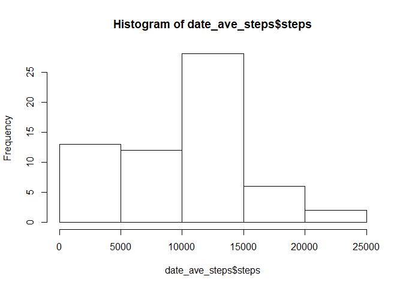

## Loading and preprocessing the data

```r
setwd("C:/Users/SamJacobJulian/Desktop/Rstd")
data <- read.csv(file = "./RepData_PeerAssessment1/activity/activity.csv", header = TRUE, comment.char = "")
```


## What is mean total number of steps taken per day?

```r
library(dplyr)
```

```
## 
## Attaching package: 'dplyr'
```

```
## The following objects are masked from 'package:stats':
## 
##     filter, lag
```

```
## The following objects are masked from 'package:base':
## 
##     intersect, setdiff, setequal, union
```

```r
#length(unique(data$date))
date_ave_steps <- data %>% group_by(date) %>% summarise_all(funs(sum),na.rm = TRUE)

hist(date_ave_steps$steps)
```

<!-- -->

```r
mean_steps <- mean(date_ave_steps$steps,na.rm = TRUE)

median_steps <- median(date_ave_steps$steps,na.rm = TRUE)
```


## What is the average daily activity pattern?
interval_ave_steps <- data[,c(1,3)] %>% group_by(interval) %>% summarise_all(funs(mean),na.rm = TRUE)

plot(interval_ave_steps,type="l")

which.max(interval_ave_steps$steps)

interval_ave_steps[104,] #206.1698

## Imputing missing values


## Are there differences in activity patterns between weekdays and weekends?
