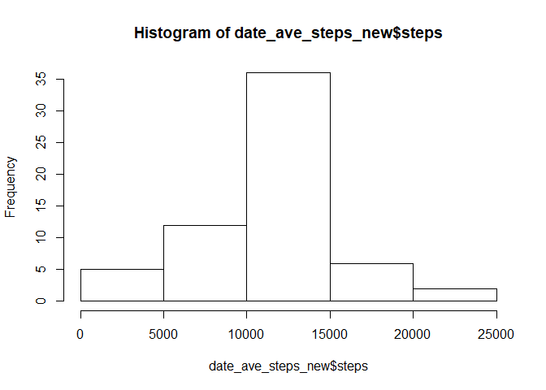
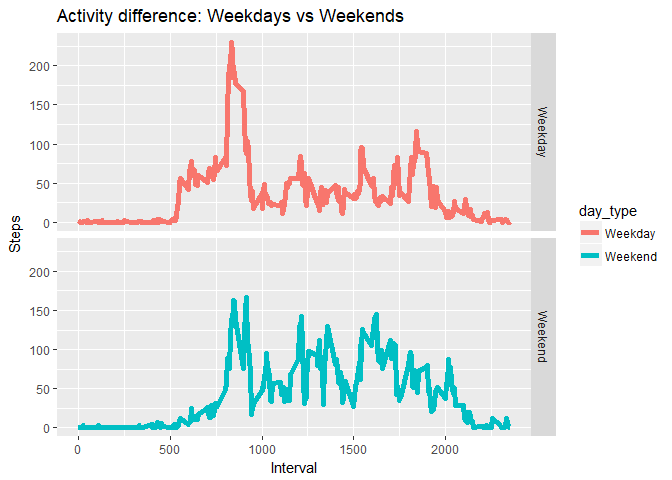

## Loading and preprocessing the data

```r
setwd("C:/Users/SamJacobJulian/Desktop/Rstd")
data <- read.csv(file = "./RepData_PeerAssessment1/activity/activity.csv", header = TRUE, comment.char = "")
```


## What is mean total number of steps taken per day?

```r
library(dplyr)
```

```
## 
## Attaching package: 'dplyr'
```

```
## The following objects are masked from 'package:stats':
## 
##     filter, lag
```

```
## The following objects are masked from 'package:base':
## 
##     intersect, setdiff, setequal, union
```

```r
#length(unique(data$date))
date_ave_steps <- data %>% group_by(date) %>% summarise_all(funs(sum),na.rm = TRUE)

hist(date_ave_steps$steps)
```

<!-- -->

```r
mean_steps <- mean(date_ave_steps$steps,na.rm = TRUE)

median_steps <- median(date_ave_steps$steps,na.rm = TRUE)
```


## What is the average daily activity pattern?

```r
interval_ave_steps <- data[,c(1,3)] %>% group_by(interval) %>% summarise_all(funs(mean),na.rm = TRUE)

plot(interval_ave_steps,type="l")
```

<!-- -->

```r
which.max(interval_ave_steps$steps)
```

```
## [1] 104
```

```r
interval_ave_steps[104,] #206.1698
```

```
## # A tibble: 1 x 2
##   interval    steps
##      <int>    <dbl>
## 1      835 206.1698
```
## Imputing missing values

```r
sum(is.na(data$steps))
```

```
## [1] 2304
```

```r
data$date <- as.Date(data$date,format("%Y-%m-%d"))
data_new <- data

z <- 1
for(i in interval_ave_steps$interval)
{
  index <- which(data$interval==i & is.na(data$steps))
  data_new[index,1] <- interval_ave_steps$steps[z]
  z <- z+1
}

date_ave_steps_new <- data_new %>% group_by(date) %>% summarise_all(funs(sum))

hist(date_ave_steps_new$steps)
```

<!-- -->

```r
mean_steps_new <- mean(date_ave_steps_new$steps)

median_steps_new <- median(date_ave_steps_new$steps)

mean_steps_new - mean_steps
```

```
## [1] 1411.959
```

```r
median_steps_new - median_steps
```

```
## [1] 371.1887
```
## Are there differences in activity patterns between weekdays and weekends?

```r
days <- lapply(data_new$date,weekdays)

wk_day_fn <- function(day)
{
  if(day %in% c("Sunday","Saturday"))
    return("Weekend")
  else
    return("Weekday")
}

days2 <- sapply(days,wk_day_fn)
data_new2 <- data_new %>% mutate(day_type = days2)
data_new2$day_type <- as.factor(data_new2$day_type)

library(ggplot2)
data_new2_mean <- aggregate(steps~interval+day_type, data=data_new2, mean)
g <- ggplot(data_new2_mean,aes(interval,steps))+geom_line(size=2,aes(color=day_type))+facet_grid(day_type~.)+ggtitle("Activity difference: Weekdays vs Weekends") + xlab("Interval")+ ylab("Steps")
g
```

<!-- -->
